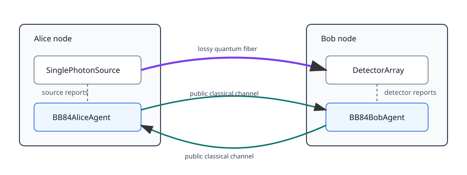
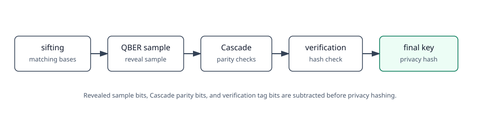

# BB84 example overview

This directory is a worked example of a protocol built on top of SimYuj. The
goal is to show how a physical network, protocol agents, and public classical
post-processing can live in one event-driven simulation.

The code is intentionally kept outside `src/simyuj`. BB84 is protocol code, not
simulator core. The simulator provides devices, channels, timelines, messages,
and network wiring. This folder uses those pieces to build one concrete
protocol.

## Network model



The run has two nodes:

- Alice has a `SinglePhotonSource` and a `BB84AliceAgent`.
- Bob has a `DetectorArray` and a `BB84BobAgent`.

The nodes are connected by:

- one quantum channel from Alice to Bob;
- one public classical channel from Alice to Bob;
- one public classical channel from Bob to Alice.

The classical channel is public and reliable in this example. The code treats
it as the authenticated public discussion channel used by BB84
post-processing.

## Physical pieces

The source uses four BB84 states:

```text
Z0 -> |0>
Z1 -> |1>
X0 -> |+>
X1 -> |->
```

The source does not emit in every clock slot. This is modeled with
`emission_probability`. A slot with no emitted photon remains a real slot; it
can be rejected later during sifting if Bob announces a detection for a slot
where Alice has no preparation record.

The quantum channel models:

- fiber length;
- attenuation in dB per km;
- fixed insertion loss;
- propagation delay;
- timing jitter;
- depolarizing noise.

The detector array models:

- detector efficiency;
- dark count rate;
- dead time;
- timing jitter;
- afterpulse parameters;
- a finite detection window;
- random BB84 basis choice at Bob.

## Protocol pieces

`BB84AliceAgent` listens to source reports and records what Alice prepared in
each emitted slot.

`BB84BobAgent` listens to detector reports and records what Bob measured. Bob
does not use Alice's internal signal ids for sifting. He assigns each detection
to a clock slot using arrival time, the expected propagation delay, and a slot
assignment window.

After Alice finishes the quantum frame, she sends a `quantum.done` message.
Bob waits for a detector guard time, then starts sifting.

## Post-processing pieces



After sifting:

1. Alice chooses a public QBER sample.
2. Bob compares that sample with his sifted bits.
3. The sample bits are removed from the key material.
4. Bob drives Cascade by sending parity requests.
5. Alice answers parity requests.
6. Bob corrects detected errors.
7. Bob sends a verification tag.
8. Alice checks the tag.
9. Bob sends a Toeplitz privacy-amplification seed.
10. Alice and Bob hash their reconciled keys down to the final key.

Cascade and hash helpers are shared with `examples/postprocessing/bb84_event`.
The physical agents in this folder are separate because they also understand
source reports, detector reports, slot assignment, and the quantum-to-classical
handoff.

## Reading the result

`run_bb84_trial` returns a dictionary. Important fields include:

```text
prepared_photons
no_emission_slots
channel_delivered
bob_detections
bob_no_usable_detection_slots
sifted_bits
estimated_qber
cascade_corrections
reconciled_bits_equal
verification_accepted
final_key_length
final_keys_equal
protocol_complete
alice_abort
bob_abort
```

An abort is not automatically a bug. Short runs often abort because there are
not enough sifted bits for QBER estimation or because the final privacy-
amplified key would be too short.

## Boundaries of the example

The example is a complete run for the model implemented here. It is still a
model.

The code does not implement decoy states. It does not model an explicit Eve.
It does not prove composable finite-key security. It assumes the public
classical channel is authenticated. These are reasonable boundaries for an
example whose job is to teach simulator structure and event-based protocol
work.
