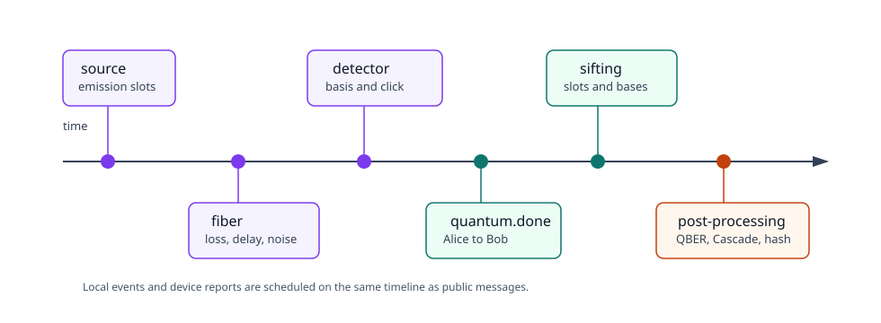

# Event flow

The useful way to read this example is as a sequence of events. The code does
not call sifting, QBER estimation, Cascade, verification, and privacy
amplification by hand from the notebook. Those steps are triggered by agent
events and classical messages.



## Quantum Starts

When the runtime starts, Alice's agent starts the source:

```text
BB84AliceAgent.on_start
    source.schedule_start(...)
    schedule local quantum.done event
```

The source schedules emission attempts over the configured clock frame. For
each emitted photon, Alice receives a source report. Alice records:

```text
slot index
signal id
emission time
basis
bit
sampler label
```

The signal travels through the quantum channel. The channel may deliver it,
delay it, disturb it, or lose it.

Bob's detector receives delivered signals. For a successful detection, Bob
records:

```text
arrival time
assigned slot index
measurement basis
bit
detector id
report flags
```

Failed detector reports are also kept. They matter when checking whether loss
and detector behavior look plausible.

## Slot assignment

In a lab, Bob does not sift with Alice's private signal id. He uses timing.
This example follows that idea.

Bob computes a slot index from:

```text
detection time
expected propagation delay
source clock period
timing assignment window
number of source slots
```

That logic lives in `assign_detection_slot_index` in `helpers.py`.

If the report is too far from a valid slot, Bob keeps it in
`unassigned_reports`. If two successful detections land in the same slot, Bob
keeps the first usable one and records the later report as a duplicate.

## Quantum done

Alice does not directly start Bob's sifting. Alice sends a public message:

```text
quantum.done
```

The message says that Alice's source frame is complete. Bob receives that
message through the classical channel, waits a detector guard time, then
schedules a local `sifting.start` event.

The guard time is small but important. It gives delayed detector reports a
chance to arrive before Bob announces his bases.

## Sifting

Bob sends:

```text
sift.bob_bases
```

The message contains only the detected slot indices and Bob's measurement
bases. Bob does not reveal his measured bits.

Alice checks each announced slot:

- if Alice has no preparation record for that slot, reject it;
- if Alice and Bob used different bases, reject it;
- if the bases match, keep the slot.

Alice replies:

```text
sift.accepted
```

The message contains the accepted slot indices. Alice and Bob then build their
sifted bit strings in the same slot order.

## QBER estimation

Alice chooses sample positions from the sifted key and sends:

```text
estimate.sample
```

This reveals the sample positions and Alice's sample bits. Bob compares those
bits with his own bits at the same positions and sends:

```text
estimate.result
```

Both sides remove the sample positions from the remaining key material. If the
estimated QBER is too high, the protocol aborts.

## Cascade

Bob drives Cascade. He sends parity requests:

```text
cascade.parity_request
```

Alice answers:

```text
cascade.parity_response
```

Each parity answer leaks one bit of information, so the example counts leaked
parity bits and subtracts them during privacy amplification.

## Verification

After Cascade, Bob sends a Toeplitz hash tag:

```text
verify.tag
```

Alice computes the same tag over her reconciled bits. If the tags match, Alice
replies:

```text
verify.result
```

This catches remaining mismatches before privacy amplification.

## Privacy amplification

Bob computes a final key length from:

```text
reconciled key length
estimated QBER
QBER safety margin
revealed sample bits
Cascade leakage
verification leakage
security margin
```

If the final key would be too short, Bob aborts. Otherwise Bob sends:

```text
privacy.seed
```

Alice and Bob use the seed to apply the same Toeplitz hash. Alice replies:

```text
privacy.done
```

At that point `protocol_complete` is true only if both final keys match.
