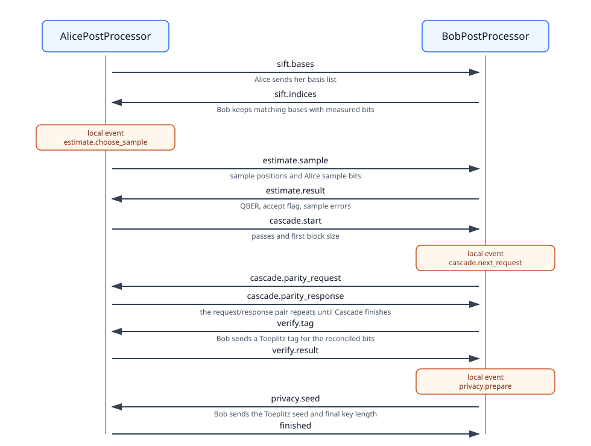

# Event-based BB84 post-processing

This example starts after Alice and Bob already have basis and measurement
records. It does not simulate the optical source, quantum channel, or detector.
Its job is narrower: show BB84 post-processing as public classical messages and
local events.

The run covers:

```text
sifting -> QBER estimate -> Cascade -> verification -> privacy amplification
```



## Run it

From the repository root:

```bash
python examples/postprocessing/bb84_event/demo.py
```

Try a smaller or noisier run:

```bash
python examples/postprocessing/bb84_event/demo.py \
  --raw-bits 512 \
  --error-sift-positions 5,17,33 \
  --missed-detection-count 4
```

The demo prints a short summary: sifted bits, rejected missed detections, QBER,
Cascade counters, verification leakage, privacy hash size, final key length,
and whether Alice and Bob ended with the same key.

## What is fixed in the demo input

`make_demo_inputs` creates deterministic teaching data:

- Alice and Bob choose matching bases for roughly half the raw positions.
- Bob can have a small number of injected bit errors.
- Bob can have missed detections, represented by `None`.
- No quantum transmission is simulated here.

That makes the post-processing easy to inspect without also debugging source,
channel, and detector behavior.

## File map

```text
agents.py     AlicePostProcessor and BobPostProcessor
cascade.py    Cascade controller used by Bob
helpers.py    sampling, parity, validation, hashes, entropy budget
messages.py   JSON encode/decode helpers for classical messages
demo.py       deterministic runnable teaching demo
docs/         short explanations and diagrams
```

Start with:

1. [Overview](docs/01_overview.md)
2. [Cascade reconciliation](docs/02_cascade.md)
3. [Verification and privacy amplification](docs/03_verification_and_privacy.md)

Then read `agents.py` with the message-flow diagram open.
