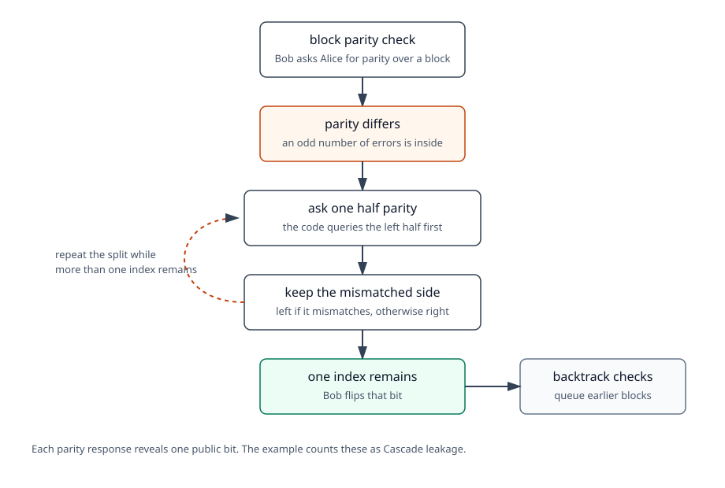

# Cascade reconciliation

Cascade is the interactive error-correction step in this example.

At this point Alice and Bob have already sifted, estimated QBER, and removed
the public sample bits. Their remaining bit strings should mostly match, but
Bob may still have a few wrong bits. Cascade lets Bob find and correct those
errors by asking Alice parity questions.

This page describes the teaching implementation used in this example. It shows
the mechanics of Cascade: block parity checks, binary search, backtracking, and
leakage accounting. It is not meant to be a tuned reconciliation library for
all possible error patterns.



## What Bob sends

Bob drives the process. He sends:

```text
cascade.parity_request
```

The message body comes from `CascadeParityRequest.as_body()`:

```text
request_id
pass_index
block_id
phase
indices
search_indices
depth
```

Alice answers:

```text
cascade.parity_response
```

with:

```text
request_id
parity
```

The `request_id` matters. Bob only accepts a response for the request currently
outstanding.

## Block checks

For each pass, Bob shuffles the current key indices and splits them into
blocks. The first pass uses `first_block_size`; later passes double the block
size:

```text
block_size = first_block_size * 2**pass_index
```

For each block, Bob asks Alice for the block parity. Bob computes the parity of
his own bits over the same indices.

If the parities match, Bob moves on.

If the parities differ, the block has an odd number of disagreements, so Bob
starts a binary search inside that block.

There is an important limitation here: a block with an even number of errors
has matching parity. Cascade can still find some of those errors later because
later passes use different shuffled blocks, but success depends on the block
schedule and the error pattern.

## Binary search

During binary search, Bob asks for the parity of the left half of the current
search region.

If the left-half parity differs, the error is in the left half. Otherwise Bob
continues with the right half.

When the search region has one index left, Bob flips that bit.

In code, that happens in:

```text
_resolve_binary_step
_flip_and_backtrack
```

## Backtracking

After Bob flips a bit, earlier blocks that contained that index may now reveal
other errors. The controller queues those earlier blocks again as
`backtrack_check` blocks.

This is why Cascade can use more parity requests than the initial number of
blocks. It is not just one pass over the key.

## What the counters mean

The demo summary reports:

```text
cascade_first_block_size
cascade_parity_requests
cascade_corrections
cascade_leaked_bits
```

In this implementation:

```text
cascade_leaked_bits == cascade_parity_requests
```

Each parity answer reveals one bit of public information. That leakage is
subtracted later during privacy amplification.

## Teaching limits

The default demo injects a small number of errors, usually one. That is enough
to show how the event flow works:

```text
parity request -> parity response -> correction -> verification
```

For small runs with several errors, the default block-size heuristic can leave
some errors uncorrected. This is expected Cascade behavior when even-error
blocks are not separated by later shuffled passes. The verification stage is
there to catch any remaining mismatch before privacy amplification.

For experiments that need stronger reconciliation behavior, tune the Cascade
parameters instead of treating the defaults as universal:

```text
first_block_size
cascade_passes
block-size cap or schedule
random seed / permutation schedule
```

The full BB84 example already exposes a capped first-block policy for this
reason. This post-processing demo keeps the rule simple so the message flow is
easy to read.

## Where to read in the code

The reconciliation mechanics live in:

```text
cascade.py
```

The message transport lives in:

```text
agents.py
```

The most useful methods to read first are:

```text
BobPostProcessor._on_cascade_start
BobPostProcessor._cascade_next_request
BobPostProcessor._on_parity_response
AlicePostProcessor._on_parity_request
```

`CascadeController` does not know about the network. It only knows how to ask
the next parity question and apply the answer.
