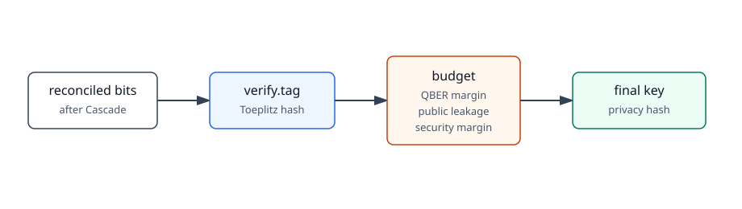

# Verification and privacy amplification

After Cascade, Bob's bits should match Alice's bits. The example does not
trust that silently. It first runs a verification hash, then compresses the
reconciled bits into a shorter final key.



## Verification

Bob sends:

```text
verify.tag
```

The body contains:

```text
tag_seed
tag
tag_len
input_len
hash_family
```

The hash family used here is Toeplitz hashing.

Alice computes the same tag over her reconciled bits. If Alice's tag matches
Bob's tag, she replies:

```text
verify.result
```

with:

```text
verified: true
```

If verification fails, Alice aborts.

The verification tag is public information. Its length is counted as
`verification_leaked_bits`.

## Privacy amplification

After verification passes, Bob schedules the local event:

```text
privacy.prepare
```

Bob then computes how many final key bits are available in this teaching model.
The budget is computed in `demo_entropy_budget`:

```text
available =
    reconciled length
    - estimated Eve information
    - Cascade leakage
    - verification leakage
    - security margin
```

The estimated Eve-information term is based on:

```text
estimated QBER + statistical margin
```

This is intentionally simple. It shows where the terms enter the pipeline, but
it is not a full finite-key security proof.

If the available key is too short, Bob aborts. Otherwise Bob sends:

```text
privacy.seed
```

with:

```text
toeplitz_seed
final_key_len
input_len
hash_family
budget_model
```

Alice and Bob both apply the same Toeplitz hash to their reconciled bits. Alice
then sends:

```text
finished
```

with the final key length.

## What to check

Useful fields in the demo summary:

```text
verification tag bits
verification seed bits
demo phase-error bound
demo Eve-info bound bits
privacy security margin bits
demo entropy budget bits
toeplitz privacy seed bits
final key bits
alice final key == bob final key
```

If `alice final key == bob final key` is false after verification and privacy,
that is a real problem. If the run aborts because the demo entropy budget is
too small, the protocol is doing what this example asks it to do.
